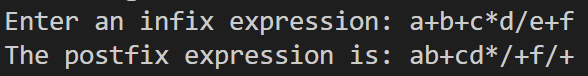

# I implemented the algorithm of infix to postfix as code.
## I found a bug that some chars are missing or some chars are inserting at middle in the output.
## The bug was arise due to MAX SIZE of arrays is 5 and I'm giving the expressions with more than 5 chars.

## I should learn what happens if we insert elements exceeding the array size.

## Here is the bug (e is missing):
