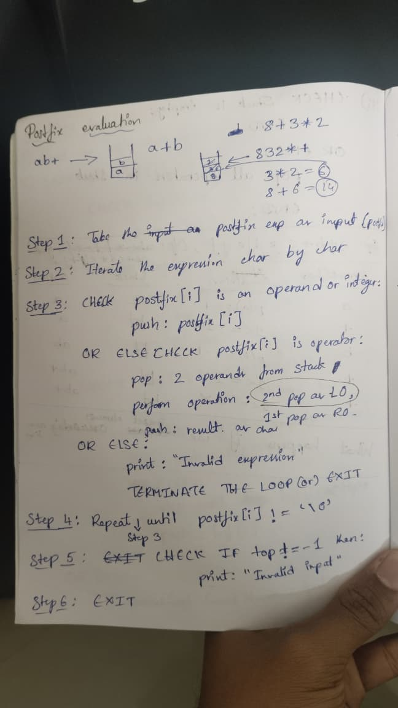

# Today, I spent building the algortihm and code of postfix expression evaluation.

## But I got a question in my mind: How does char stack storing 2 digit of numbers as chars?
## I need to know it.

## Here is the proof or algorithm:
