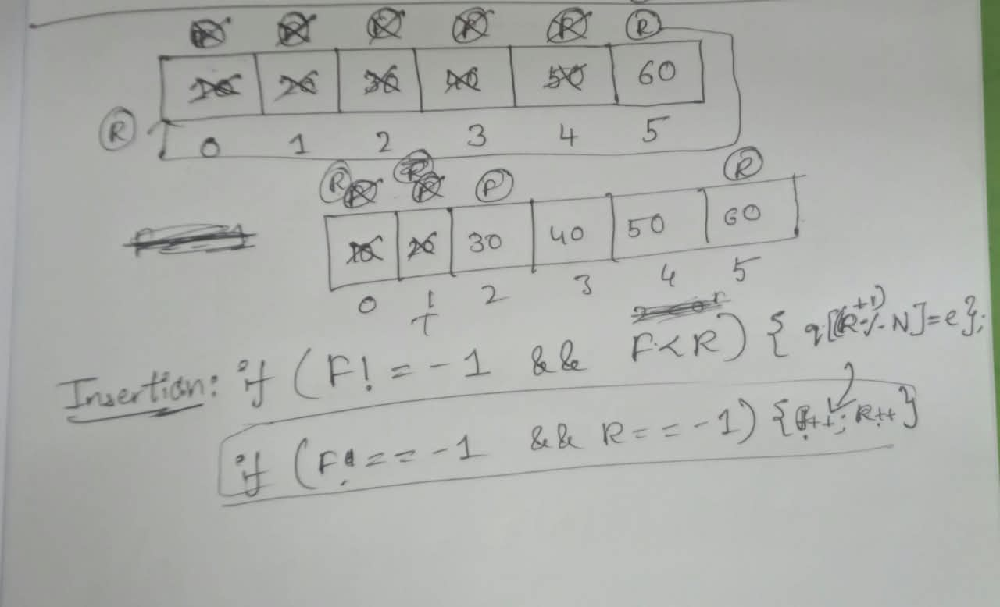

# Today, I started thinking about how to implement the circular queue in arrays.

## But I was stucked at how front and rear gets updated and how to use empty spaces to insert elements.

## I tried the approach but it failed because I'm not remembering it, I'm building it from scratch myself.

