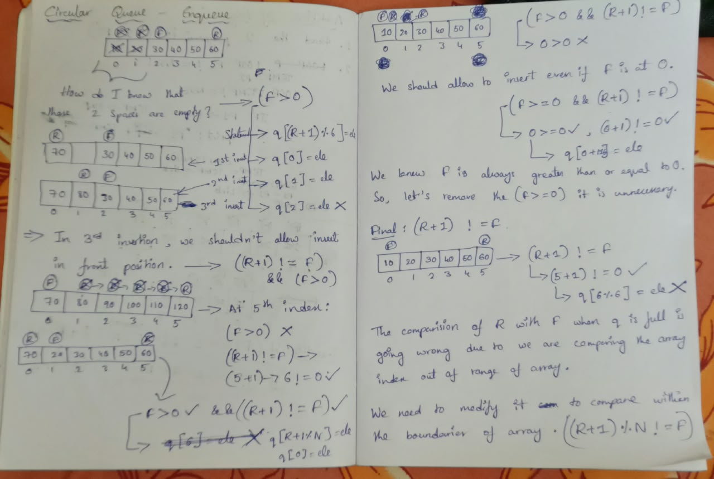

# Today, I implemented the approach for enqueue operation in circular queue from scratch.

## I implemented it using whatever the conditions I get in my mind to allow to perform enqueue and also I starting thinking about where it breaks. And again I repeated finding new conditions and breaking them.

## At last I found it: (rear + 1 != front).

### I don't know why this condition is used. And I started deriving it from first principles, finally the above condition made sense to me and below are my conditions and where they broken.



## And also I wrote the algorithm for it. Below.

.jpeg)

## One small correction in algorithm:
```C
if((rear+1) % size == front){
    queue[(rear + 1) % size] = ele;
    rear++;
}
```