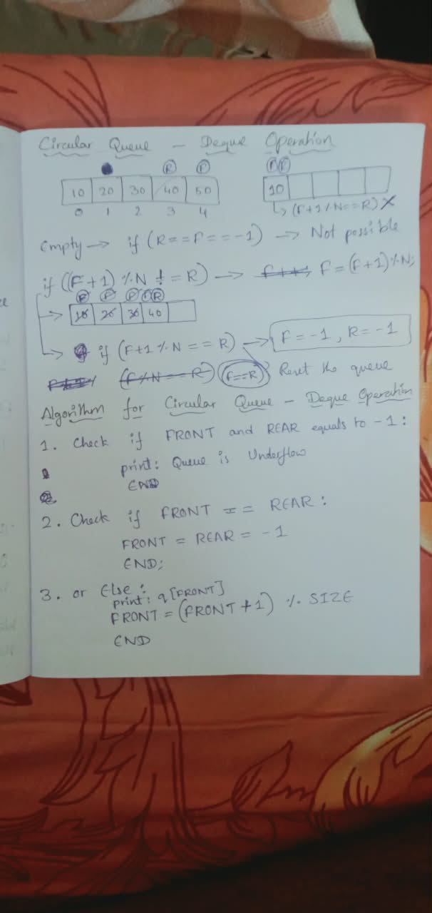

# Today, I started thinking about how to implement dequeue operation in circular queue.

## Literally, I just used the same condition used in enqueue in reverse order (f+1 % N != r).

## It failed when front & rear are at 0th index.

## It went to (f % N != r) and it is waste of comparing with N. So, it turned out to be (f != r).

## And I wrote the algorithm below:

