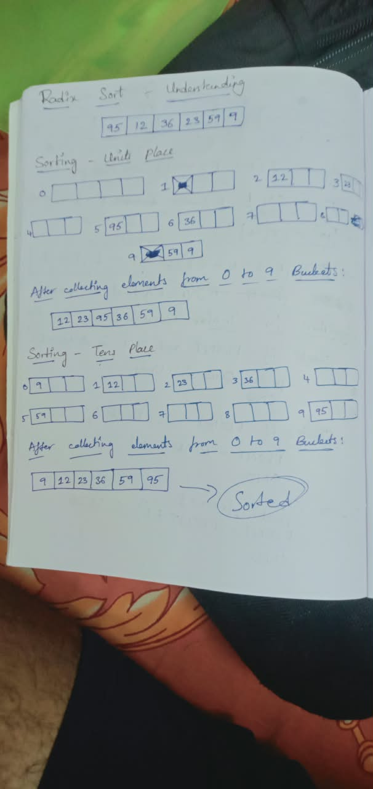

# Today I understood the radix sort algorithm.

## I used ChatGPT to just explain how it does not the code, implementation or algorithm.

## So, it just explained how it works like rearranging the data in the array based on the unit place of digits.

## Initally, I thought like I need to compare each element digit's place with other elements and swapping them.

## But it feels like normal sorting. So, I thought about a new approach where I could store the elements if radix 10 in 10 new arrays (buckets) where each array represents 0-9.

## This is the proof of understanding it:
